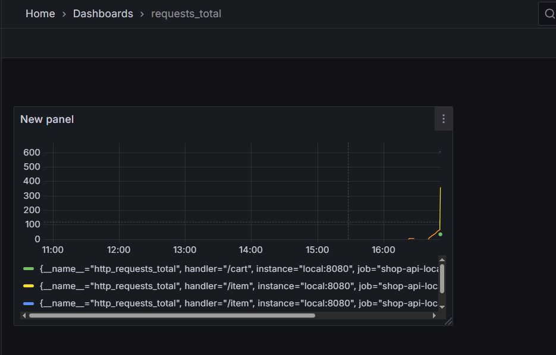
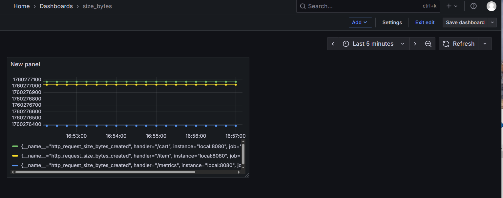

# ДЗ

## Настроить сборку образов Docker и мониторинг с помощью Prometheus и Grafana

Интегрировать Docker с Prometheus и Grafana в любой уже написанный в ДЗ сервис (по аналогии с тем, как в репе)

По сути, если вы выполнили вторую домашку, то теперь для неё надо написать Dockerfile и настроить мониторинг. Если вторую домашку вы не делали, то можно взять сервис из [rest_example](../hw2/rest_example/main.py)

Сдача через PR, так же нужно:

1) Dockerfile для сборки сервиса
2) docker-compose.yml для локального разворачивания в Docker
3) Приложить скрин с парой Дашбордов в Grafana

